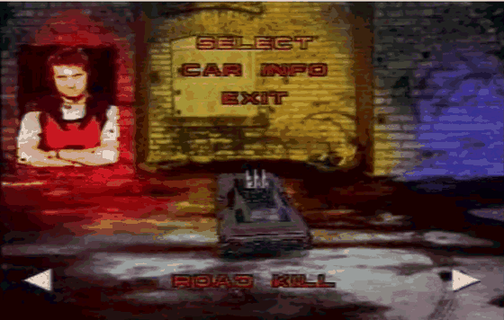
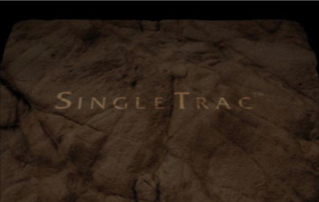
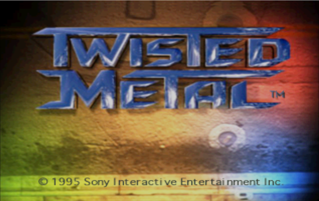
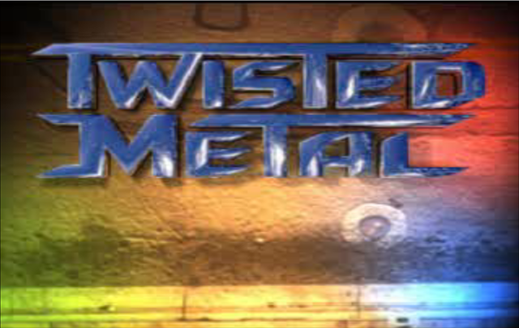
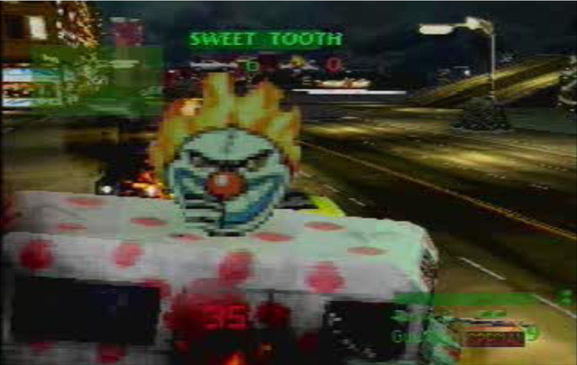
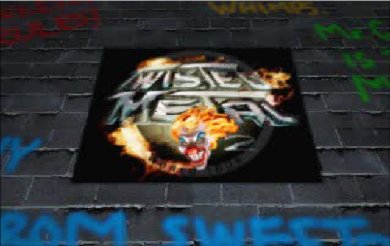
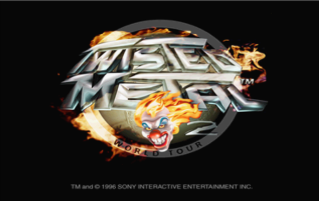

# 🚗🔥 twistedmetal-psn — Static Recompilation

A static recompilation of **Twisted Metal (PSOne Classic, PS3/PSN)** into a native PC
executable — no emulator required — built on
[ps3recomp](https://github.com/sp00nznet/ps3recomp).

> **The twist:** this package contains no PS3 game code at all. It is a PS1 disc image in
> a wrapper, and the thing that runs it is a PS3 *firmware* module. So the recompilation
> target is **`ps1_netemu.self` — Sony's own PS1 emulator for the PS3** — and the PS1 game
> is just the data it eats. Recompile that once and every PSOne Classic in the catalogue
> runs, not only this one.

---

## 📸 It runs



*Car select, live --- the model rendering through the emulated PS1 GPU on four SPUs.*

And unattended: one launch, no input, screenshots taken 5 s apart as it plays itself in.

| | |
|---|---|
|  |  |
| The intro movie --- MDEC video, decoded and composited | The title screen |
|  |  |
| The movie's logo shot | **Attract mode** --- the 3D gameplay demo |


**The full sequence, from one run:** boot &rarr; BIOS &rarr; disc mount &rarr; intro
cards &rarr; **intro FMV** &rarr; title screen &rarr; **attract mode**. Menus respond to
input; the pad is wired.

### And it is not one game

The recompilation target is the **emulator**, so a second disc costs nothing but its
content id. **Twisted Metal 2** boots on the same executable, unmodified:

| | |
|---|---|
|  |  |
| Its intro movie --- same MDEC path | *Twisted Metal 2: World Tour* |

```sh
PS1_CONTENT=NPUI94306 PS1_SERIAL=SCUS94306 ./tools/run.sh
```

Boots, plays the SingleTrac logo movie and its own intro, and sits at the title
screen. Nothing in the port is Twisted Metal specific --- `tools/run.sh` takes the
content id and serial, and the other 141 PSOne Classics use the same two knobs.


## 📺 What's in the box

`Twisted Metal PSN [NPUI-94304]` is a **PSOne Classic** (`PARAM.SFO: CATEGORY=1P`),
not a native PS3 title:

| | |
|---|---|
| **Title** | Twisted Metal |
| **PSN Content ID** | `UP9000-NPUI94304_00-0000000000000001` |
| **PS1 Title ID** | `SCUS94304` (SingleTrac / Sony, 1995) |
| **Package** | 75 MB retail PKG, `pkg_type=2` (PSP/PS1 keying) |
| **Payload** | `USRDIR/CONTENT/EBOOT.PBP` (68.7 MB) — `DATA.PSAR` @ `0x18000` holds the disc |
| | `USRDIR/ISO.BIN.EDAT` (1.0 MB) — NPD v1 type-2 EDAT, the DRM half |
| | `USRDIR/CONTENT/DOCUMENT.DAT` (5.1 MB) — PGD-encrypted manual |
| | `USRDIR/SAVEDATA/SCEVMC{0,1}.VMP` — blank virtual memory cards |
| **Runs under** | `/dev_flash/ps1emu/ps1_netemu.self` (PS3 firmware, 922 KB SELF) |

The guess was right: it is an emulator wrapped around an ISO. The emulator just isn't
*in* the package — it ships with the console.

## 🎯 The recompilation target

`ps1_netemu.self`, decrypted with `rpcs3 --decrypt` (retail key revision `0x1C`, no RAP):

| | |
|---|---|
| Decrypted ELF | 2,913,992 B — PPC64, big-endian, `ET_EXEC` |
| Entry | `0x1B5690` (OPD) |
| `.text`+`.rodata` | PT_LOAD @ `0x10000`, `0x199368` B |
| `.data`/BSS | PT_LOAD @ `0x1B0000`, filesz `0x126E68`, **memsz `0x1D9E1E8`** (~31 MB — PS1 RAM, VRAM, SPU RAM, caches) |
| Functions found | **3,512** (`find_functions.py`; every `.opd` descriptor verified as a function start) |
| Imports | **103 functions across 12 libraries**, 86 named (83%) |
| Embedded SPU ELFs | **2**, extracted statically — 86,452 B (entry `0x100`) and 59,580 B (entry `0xE0`) |
| Data it reads | `/dev_flash/ps1emu/ps1_rom.bin` (512 KB PS1 BIOS), `USRDIR/CONTENT/EBOOT.PBP`, `USRDIR/ISO.BIN.EDAT` |

**3,512 functions is small** — smaller than The Simpsons Arcade Game (3,813). This is a
tight, single-purpose emulator, not a game engine.

Internals visible in the strings: `cell/host.c`, `cell/xspu.cc`, `R3000Exit(): PS1_EXIT_STOP`,
`GPUCoreInit()`, `PSISOIMG0000`, a per-title compatibility table keyed by PS1 serial
(`SCES_000.08`, `SCES_016.95`, …), and a full statically-linked libgcm with its debug
assertions intact.

## 🖥️ Graphics — and why this one is different

The sister ports that render (**Simpsons Arcade**, **flOw**, **You Don't Know Jack**) all
reach caner's (canersaka) live NV4097 → D3D12 draw engine the same way: they *import*
`cellGcmSys`, ps3recomp's HLE implementation of it walks the pushbuffer, and
`rsx_live_draw_method()` gets fed. `RSX_LIVE_DRAW=1` and it draws.

**`ps1_netemu` imports no `cellGcmSys`.** Being a firmware module it links libgcm
*statically* and talks to the GPU through the kernel — twelve `sys_rsx_*` syscalls,
all identified by disassembling each `li r11,N` / `sc` pair with the libgcm wrapper
around it. (The numbering is two *lower* than the usual published table: `675` is
`device_map`, not `context_iounmap`.)

So we use **the same renderer, hooked one layer lower** — implemented in
`ps3recomp/libs/video/sys_rsx.c`. The engine, the method decoder, the D3D12 backend and
`RSX_LIVE_DRAW=1` are all unchanged; only the tap point moves. Two facts out of the
disassembly are what make it a bridge rather than a rewrite:

- `*(u32*)lpar_driver_info` must be `0x211` — `cellGcmInit`'s version handshake.
- the `put`/`get`/`ref` triple sits at `lpar_dma_control + 0x40`, so
  `context_allocate` returns *(the walker's control address − 0x40)* and the driver's
  own flushes land exactly where the existing FIFO walker already reads.

**And the thing that was actually failing wasn't graphics at all.** With every RSX
syscall implemented, `cellGcmInit` still failed — without reaching one of them. It
gives up when `sys_process_get_sdk_version` returns zero, and that syscall was an
unimplemented stub leaving its out-param untouched. libgcm sizes its RSX local heap
off that value on a compatibility ladder (≥2.20 → 249 MB, ≥2.00 → 242, ≥1.90 → 234,
≥1.80 → 232, else 224), which is how the syscall got identified in the first place.
Implementing it is what unblocked the GPU. Full derivation:
[`docs/graphics-path.md`](docs/graphics-path.md).

## 🛠️ Pipeline

```
  dev_flash ─► ps1_netemu.self ─► .elf ─► ppu_lifter ─► C++ ─┐
              (firmware SELF)   (decrypt)  (3,512 fns)       ├─► link ps3recomp ─► tmpsn.exe
                                2 SPU ELFs ─► spu_lifter ─►──┘        (harness + HLE)
                                                                              │
  PSN PKG ─► EBOOT.PBP + ISO.BIN.EDAT ─────────────────────────────► game data (fed, not lifted)
```

The PS1 disc is **never** decrypted by us: the recompiled emulator does its own
EDAT/PSAR handling, exactly as it does on hardware.

## 🎯 Status

**It plays itself in.** The recompiled PS1 emulator boots, brings up RSX through the
kernel, starts its five raw SPUs, mounts and decrypts the disc, runs the PS1 BIOS, runs
the game, decodes the intro movie, and reaches the attract demo --- all on a native
executable with no emulator around it.

| | |
|---|---|
| Recompilation | 3,512 PPU functions + 2 SPU modules, **0 unhandled instructions** |
| R3000 core | **4.2 billion instructions** in a 360 s run, ~14 MIPS, no stalls |
| Renderer | live NV4097 &rarr; D3D12, PS1 GPU on 4 SPUs, polygons and blits both landing |
| Video | MDEC decode working --- intro FMV plays in full colour |
| Sequence reached | intro cards &rarr; FMV &rarr; title &rarr; attract mode, unattended |
| Input | pad wired; menus navigable |

### The two bugs that mattered

Both were in the shared toolchain, not in this port, and both are fixed upstream:

- **`GETLLAR` read guest memory twice.** A PPU store landing between the two reads left
  the SPU with a stale line and its reservation snapshot fresh, so neither side could
  wake the other. One run in three froze; after the fix, 4.2 billion instructions clean.
- **Five VMX instructions were wrong or missing.** `vmsumshs`, `vsumsws` and `vmulesh`
  were emitted as `/* TODO */` no-ops --- and 32 of those sites were inside MDEC's decode
  function, so the inverse DCT never ran. `vsraw`, `vrlw`, `vmulosh` and integer
  `vmax`/`vmin` read big-endian lanes through host typed pointers, i.e. byte-reversed.
  Fixing them is what made the movie appear.

Full account, in the order it happened and including the wrong turns:
[`docs/status-log.md`](docs/status-log.md).

## 📚 Docs

| | |
|---|---|
| [`docs/status-log.md`](docs/status-log.md) | how each blocker was found and fixed, chronologically |
| [`docs/ps1-core.md`](docs/ps1-core.md) | the PS1 core: R3000, scheduler, GPU SPUs, MDEC --- the deep notes |
| [`docs/upstreamed.md`](docs/upstreamed.md) | changes this port required in ps3recomp |
| [`docs/graphics-path.md`](docs/graphics-path.md) | how a statically-linked libgcm was bridged to the live renderer |
| [`docs/npdrm.md`](docs/npdrm.md) | PKG / EDAT / PSAR key handling |
| [`docs/disc-path.md`](docs/disc-path.md) · [`docs/disc-body.md`](docs/disc-body.md) | how the emulator finds and opens the disc |
| [`docs/boot-argv.md`](docs/boot-argv.md) | the nine arguments the VSH passes a PSOne Classic |
| [`docs/raw-spu.md`](docs/raw-spu.md) | raw SPU MMIO and interrupt delivery |
| [`PROGRESS.md`](PROGRESS.md) | the raw running log |

## 📦 Building

Prereqs: Python 3.9+, CMake 3.20+, **clang-cl** + Ninja, and a sibling
[ps3recomp](https://github.com/sp00nznet/ps3recomp) checkout.

```bash
# 1. Supply your own firmware module and your own copy of the game:
#      fw/ps1_netemu.self     <- from your console's dev_flash/ps1emu/
#      fw/ps1_rom.bin         <- likewise
#      pkg/*.pkg              <- your own PSN download
#    then decrypt and unpack:
rpcs3 --decrypt fw/ps1_netemu.self
python ../ps3recomp/tools/pkg_extract.py pkg/*.pkg extracted

# 2. Lift PPU + SPU and generate the HLE NID table:
PS3RECOMP=../ps3recomp ./tools/relift.sh

# 3. Build (Release matters -- an unoptimised build of the generated TU runs ~3x slower).
#    llvm-rc: clang-cl outside a VS dev prompt cannot find Microsoft's rc.exe.
cmake -S . -B build -G Ninja       -DCMAKE_C_COMPILER="C:/Program Files/LLVM/bin/clang-cl.exe"       -DCMAKE_CXX_COMPILER="C:/Program Files/LLVM/bin/clang-cl.exe"       -DCMAKE_RC_COMPILER="C:/Program Files/LLVM/bin/llvm-rc.exe"
cmake --build build

# 4. Run with the live NV4097 -> D3D12 draw engine. tools/run.sh sets PS3_DEV_FLASH
#    (where /dev_flash/ps1emu/ps1_rom.bin comes from), PS3_HDD0_ROOT (where the
#    unpacked package lives) and RSX_LIVE_DRAW=1:
./tools/run.sh
```

## ⚖️ Legal

This repository distributes **no game code, no assets, no firmware, no encryption keys**
--- only analysis notes, configuration and recompilation tooling. You must supply your
own legally obtained console firmware and your own copy of the game. `fw/`, `pkg/`,
`extracted/`, `extracted_crack/`, `vfs/` and the lifted output (`src/recomp/`,
`src/spu_gen/`) are git-ignored.

To be explicit about what the notes *do* contain: the write-ups quote **excerpts of
disassembly** from `ps1_netemu` --- roughly 500 lines across `docs/` and `PROGRESS.md`
--- together with function addresses and reverse-engineered structure layouts. That is
the analysis itself, and a reverse-engineering write-up cannot exist without it. The
cryptographic constants in `src/ecdsa_probe.c` and `docs/disc-body.md` are
**verification-side only**: published curve parameters, a public key, and one signature
with its hash taken from the disc header. There is no private key, no ERK, no
klicensee and no RAP anywhere in this repository or its history --- nothing that
decrypts or forges anything.

**The screenshots and the recording** in `docs/img/` are frames of the running game. The imagery in them ---
Twisted Metal, its characters and its video --- belongs to its rights holders (Sony
Interactive Entertainment / the original SingleTrac team). They are reproduced here for
one purpose only: to show that the recompilation works. No claim of ownership is made,
and they will be removed on request from any rights holder.

Licence: [MIT](LICENSE), covering this repository's own tooling, scripts and notes.

## 🔗 Related Projects

- [ps3recomp](https://github.com/sp00nznet/ps3recomp) — the PS3 HLE runtime this links against
- [simpsonsarcade-ps3](https://github.com/sp00nznet/simpsonsarcade-ps3) · [flOw](https://github.com/sp00nznet/flow) · [youdontknowjack](https://github.com/sp00nznet/youdontknowjack) — the sister ports that render
- [twistedmetal](https://github.com/sp00nznet/twistedmetal) — the *other* Twisted Metal, the 2012 PS3 disc game
- [RPCS3](https://github.com/RPCS3/rpcs3) — emulator whose HLE research (and `--decrypt`) makes this possible
